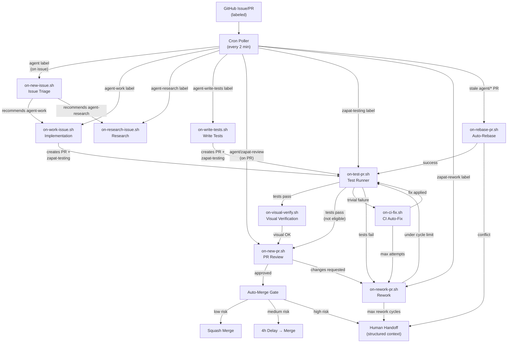
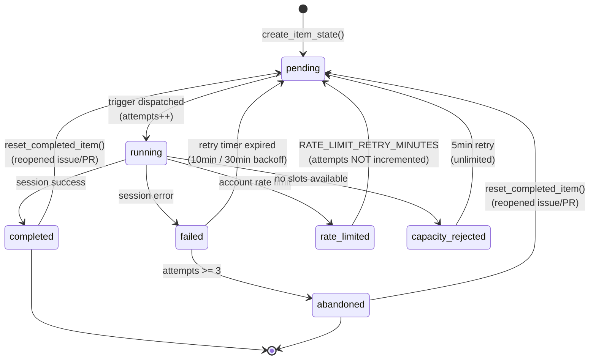

# Zapat Architecture

> **This is the single source of truth for Zapat's system design.** When in doubt, this document is correct. If code and docs disagree, update whichever is wrong and run `npm test` to verify consistency.

---

## 1. System Overview

Zapat is an autonomous development pipeline framework that transforms GitHub issues into tested, reviewed, merge-ready pull requests — without human intervention. A cron-based poller scans configured repositories every 2 minutes for labeled issues and PRs, then dispatches specialized Claude Code agent teams in isolated git worktrees. Each pipeline stage uses expert personas (engineers, security reviewers, product managers, UX critics) that collaborate, review each other's work, and converge on a result.

**Design philosophy:**

- **Label-driven** — A single GitHub label triggers the entire pipeline. No CLI invocations, no webhooks, no CI config.
- **Isolated** — Every agent job runs in a disposable git worktree under `~/.zapat/worktrees/`. The user's main checkout is never touched.
- **Self-healing** — Every poll cycle runs health checks: cleans orphaned worktrees, stale concurrency slots, dead tmux sessions.
- **Modular** — Each pipeline stage is a standalone trigger script. New stages are added by creating a trigger, a prompt, and a poller scan block.
- **Feature-flagged** — Optional pipeline stages (visual verification, CI auto-fix) default to disabled and activate via `.env` toggles.

---

## 2. Pipeline Flow



**Sequential flow (post-infinite-loop fix):** Rework always adds `zapat-testing`, never `zapat-review` directly. Tests must gate every re-review.

```
implement → test → review → (changes requested) → rework → test → review → ...
                                                      ↑ cycle counter enforced
```

---

## 3. Component Reference

### `bin/` — Core Scripts

| File | Purpose | Interface |
|------|---------|-----------|
| `poll-github.sh` | Cron heartbeat. Scans all repos for labeled items, dispatches triggers, runs auto-merge/rebase/health. ~1055 lines. | Runs via cron; no arguments |
| `notify.sh` | Unified notification dispatcher (Slack + GitHub comments). | `--slack --message TEXT --job-name NAME --status STATUS` |
| `setup-labels.sh` | Creates/updates all pipeline labels across configured repos. | Run manually; reads `repos.conf` |
| `run-agent.sh` | Headless agent runner for scheduled jobs (standup, planning). Uses `claude -p`. | `--job-name --prompt-file --budget --timeout` |
| `startup.sh` | Post-reboot init: tmux session, cron, state seeding, dashboard. | `--seed-state` to force re-seed |
| `zapat` | Thin shell wrapper → `node src/cli.mjs "$@"`. | Subcommands: status, health, metrics, risk, dashboard, logs, start, stop, program |

### `triggers/` — Event Handlers

All triggers follow the same lifecycle: source libs → load env → create item state → acquire slot → fetch GitHub data → create worktree → build prompt → launch Claude → monitor → update labels → cleanup → update state.

| File | Trigger Label | Worktree Type | Prompt | Agent Model | Timeout |
|------|--------------|---------------|--------|-------------|---------|
| `on-new-issue.sh` | `agent` (issue) | Read-only | `issue-triage.txt` | Lead (Opus) | `TIMEOUT_ISSUE_TRIAGE` (600s) |
| `on-work-issue.sh` | `agent-work` | Writable `agent/issue-N-slug` | `implement-issue.txt` | Lead (Opus) | `TIMEOUT_IMPLEMENT` (1800s) |
| `on-new-pr.sh` | `agent`/`zapat-review` (PR) | Read-only | `pr-review.txt` | Lead (Opus) | `TIMEOUT_PR_REVIEW` (600s) |
| `on-test-pr.sh` | `zapat-testing` | Writable PR branch | `test-pr.txt` | Utility (Haiku) | `TIMEOUT_TEST_PR` (1200s) |
| `on-rework-pr.sh` | `zapat-rework` | Writable PR branch | `rework-pr.txt` | Lead (Opus) | `TIMEOUT_IMPLEMENT` (1800s) |
| `on-visual-verify.sh` | `zapat-visual` | Writable PR branch | `visual-verify.txt` | Sub-agent (Sonnet) | `TIMEOUT_VISUAL_VERIFY` (600s) |
| `on-ci-fix.sh` | `zapat-ci-fix` | Writable PR branch | `ci-fix.txt` | Utility (Haiku) | `TIMEOUT_TEST_PR` (1200s) |
| `on-rebase-pr.sh` | Auto (stale agent PR) | Temporary PR branch | None (git only) | N/A | N/A |
| `on-research-issue.sh` | `agent-research` | Read-only | `research-issue.txt` | Lead (Opus) | `TIMEOUT_RESEARCH` (1800s) |
| `on-write-tests.sh` | `agent-write-tests` | Writable `agent/write-tests-issue-N` | `write-tests.txt` | Lead (Opus) | `TIMEOUT_WRITE_TESTS` (1800s) |

### `lib/` — Shared Libraries

| File | Purpose | Key Exports |
|------|---------|-------------|
| `common.sh` | Foundation library (~1013 lines). Environment, logging, multi-project, repos, concurrency, agent config, prompt substitution, complexity classification. | `load_env()`, `read_repos()`, `acquire_slot()`, `release_slot()`, `substitute_prompt()`, `classify_complexity()`, `generate_task_assessment()`, `launch_claude_session()` (delegated to tmux-helpers), `set_project()`, `read_projects()` |
| `item-state.sh` | JSON-file state machine for work item lifecycle (~318 lines). | `create_item_state()`, `update_item_state()`, `get_item_state()`, `should_process_item()`, `reset_completed_item()`, `increment_rework_cycles()`, `get_rework_cycles()`, `list_retryable_items()` |
| `tmux-helpers.sh` | Reliable tmux session management (~398 lines). Pane health monitoring, idle detection, rate limit handling. | `launch_claude_session()`, `monitor_session()`, `check_pane_health()`, `wait_for_tmux_content()` |

### `prompts/` — Prompt Templates

Templates use `{{PLACEHOLDER}}` syntax. `substitute_prompt()` appends `_shared-footer.txt` automatically.

| File | Used By | Team Size | Key Output |
|------|---------|-----------|------------|
| `_shared-footer.txt` | All prompts (appended) | — | Repo map, safety rules, `/exit` directive |
| `issue-triage.txt` | `on-new-issue.sh` | 3+ agents | Complexity, priority, labels, implementation decision |
| `implement-issue.txt` | `on-work-issue.sh` | 3-5 agents | Code + tests + PR |
| `pr-review.txt` | `on-new-pr.sh` | 3-5 agents | Risk level, auto-merge recommendation, review comments |
| `rework-pr.txt` | `on-rework-pr.sh` | 3-5 agents | Blocking fixes + suggestion fixes + tests |
| `test-pr.txt` | `on-test-pr.sh` | 1 agent | `<!-- agent-test-passed -->` or `<!-- agent-test-failed -->` |
| `research-issue.txt` | `on-research-issue.sh` | 3+ agents | Research findings, sub-issues, interface contracts |
| `visual-verify.txt` | `on-visual-verify.sh` | 1 agent | Screenshot-based UX review |
| `ci-fix.txt` | `on-ci-fix.sh` | 1 agent | Targeted lint/type/format fixes |
| `write-tests.txt` | `on-write-tests.sh` | 1 agent | Test files + PR |
| `build-tests.txt` | Standalone | 1 agent | Test infrastructure + 10+ tests + PR |
| `daily-standup.txt` | `run-agent.sh` (cron) | 1 agent | Status summary |
| `weekly-planning.txt` | `run-agent.sh` (cron) | 1 agent | Sprint plan |
| `monthly-strategy.txt` | `run-agent.sh` (cron) | 1 agent | Strategy review |
| `weekly-security-scan.txt` | `run-agent.sh` (cron) | 1 agent | Security scan |

### `agents/` — Agent Persona Definitions

Each persona is a Markdown file with YAML frontmatter (`name:`, `permissionMode: bypassPermissions`).

| File | Role ID | Focus |
|------|---------|-------|
| `engineer.md` | builder | Senior engineer: read-before-write, follow existing patterns |
| `security-reviewer.md` | security | OWASP, injection, auth, secrets, dependency vulns |
| `product-manager.md` | product | User problems, acceptance criteria, scope validation |
| `ux-reviewer.md` | ux | Friction, accessibility, consistency, progressive disclosure |
| `devops-engineer.md` | devops | CI/CD, IaC, reliability, rollback strategies |
| `qa-engineer.md` | qa | Adversarial testing, coverage gaps, regression prevention |
| `technical-writer.md` | writer | Accuracy-first docs, examples, changelog |

### `config/` — Configuration

| File | Format | Purpose |
|------|--------|---------|
| `{project}/repos.conf` | TSV: `owner/repo\tlocal_path\ttype` | Repository registry. Types: `backend`, `web`, `ios`, `mobile`, `extension`, `marketing`, `other` |
| `{project}/agents.conf` | `role=persona` | Agent role → persona mapping. Supports `role.repo_type=persona` overrides |
| `{project}/project-context.txt` | Freeform text | Injected as `{{PROJECT_CONTEXT}}` into prompts |
| `{project}/project.env` | Key=value | Project-level env overrides (layered on global `.env`) |
| `projects.conf` | One slug per line | Multi-project manifest (optional; auto-discovered from `config/*/repos.conf`) |

### `state/` — Runtime State

| Path | Format | Purpose |
|------|--------|---------|
| `items/*.json` | JSON | Per-item state machine files |
| `processed-*.txt` | Line-delimited keys | Dedup tracking for each item type |
| `last-mention-poll.txt` | ISO 8601 timestamp | `@zapat` mention polling cursor |
| `agent-work-slots/` | `slot-PID.pid` JSON files | Work/rework/test concurrency tracking |
| `triage-slots/` | `slot-PID.pid` JSON files | Triage/review concurrency tracking |
| `poll.lock/` | Directory (atomic) | Exclusive lock for poll cycle |
| `pane-signals/` | Signal files | Rate limit signals from pane health checks |
| `pane-health-throttle/` | Timestamp files | Throttle pane health notifications |
| `program-throttle/` | Timestamp files | Throttle program status updates |
| `dashboard.pid` | PID file | Dashboard process tracking |

### `src/` — Node.js CLI

Entry point: `bin/zapat` → `node src/cli.mjs` (built with `commander`).

| Command | File | Purpose |
|---------|------|---------|
| `status` | `commands/status.mjs` | Pipeline overview: active sessions, recent jobs, success rate |
| `health` | `commands/health.mjs` | Health checks with `--auto-fix`: tmux, slots, worktrees, gh auth |
| `metrics` | `commands/metrics.mjs` | Query/record JSONL metrics |
| `risk` | `commands/risk.mjs` | PR risk classification (score-based) |
| `dashboard` | `commands/dashboard.mjs` | Launch/manage Next.js dashboard |
| `logs` | `commands/logs.mjs` | Rotate and compress log files |
| `program` | `commands/program.mjs` | Program-level status for parent + sub-issues |
| `start` | CLI | Start pipeline (`startup.sh` wrapper) |
| `stop` | CLI | Stop pipeline |
| `projects` | CLI | List configured projects |
| `init` | CLI | Initialize new project directory |

### `dashboard/` — Next.js Monitoring Dashboard

Real-time pipeline monitoring with:
- Kanban board (issues/PRs by pipeline stage)
- Success rate charts
- Activity feed
- Health status panel

Data source: reads GitHub labels and `state/` files via `dashboard/src/lib/data.ts`.

---

## 4. State Machine



**State file schema** (`state/items/{project}--{repo}_{type}_{number}.json`):

```json
{
  "project": "default",
  "repo": "owner/repo",
  "type": "issue|pr|work|rework|test|write-tests|research|rebase",
  "number": "123",
  "status": "pending|running|completed|failed|abandoned|capacity_rejected|rate_limited",
  "created_at": "ISO8601",
  "updated_at": "ISO8601",
  "attempts": 0,
  "last_error": null,
  "next_retry_after": null,
  "parent_issue": null,
  "rework_cycles": 0
}
```

**Retry logic:**
- 1st failure → 10 min backoff
- 2nd failure → 30 min backoff
- 3rd failure → `abandoned` (no more retries)
- Capacity rejection → 5 min retry (unlimited, doesn't count as failure)
- Rate limit → configurable delay (default 60 min), does NOT count toward attempt limit

**Rework cycle counter:** Tracked in `rework_cycles` field. Incremented by `on-rework-pr.sh` after each rework session. When `rework_cycles >= MAX_REWORK_CYCLES` (default 3), the PR is escalated with `hold` label.

---

## 5. Label Protocol

### User-Facing Labels (apply manually)

| Label | Applicable To | Effect |
|-------|--------------|--------|
| `agent` | Issues | Trigger triage → agent team evaluates and recommends action |
| `agent` | PRs | Trigger code review by agent team |
| `agent-work` | Issues | Skip triage, implement immediately |
| `agent-research` | Issues | Research and analyze, produce findings (no code) |
| `agent-write-tests` | Issues | Write tests for specified code |
| `agent-full-review` | PRs | Force full team review regardless of complexity classification |
| `hold` | PRs | Block auto-merge indefinitely |
| `human-only` | Issues/PRs | Pipeline will not touch this item |

### Status Labels (pipeline-managed)

| Label | Set By | Removed By | Meaning |
|-------|--------|------------|---------|
| `zapat-triaging` | `on-new-issue.sh` (start) | `on-new-issue.sh` (end) | Triage in progress |
| `zapat-implementing` | `on-work-issue.sh` (start) | `on-work-issue.sh` (end) | Implementation in progress |
| `zapat-review` | `on-test-pr.sh` (pass) | `on-new-pr.sh` (end) | Code review pending |
| `zapat-testing` | `on-work-issue.sh` (PR created), `on-rework-pr.sh` (under limit), `on-rebase-pr.sh` (success) | `on-test-pr.sh` (end) | Tests running |
| `zapat-rework` | `on-test-pr.sh` (fail), auto-rework detection | `on-rework-pr.sh` (end) | Addressing review feedback |
| `zapat-researching` | `on-research-issue.sh` (start) | `on-research-issue.sh` (end) | Research in progress |
| `zapat-visual` | `on-test-pr.sh` (pass, UI-eligible) | `on-visual-verify.sh` (end) | Visual verification in progress |
| `zapat-ci-fix` | `on-test-pr.sh` (trivial failure) | `on-ci-fix.sh` (end) | CI auto-fix in progress |
| `needs-rebase` | `on-rebase-pr.sh` (conflict) | Manual | Auto-rebase failed, needs manual resolution |

### Classification Labels

`feature`, `bug`, `tech-debt`, `security`, `research` — applied by triage agent.

### Priority Labels

`P0-critical`, `P1-high`, `P2-medium`, `P3-low` — applied by triage agent.

### Label Lifecycle: Implementation Flow

```
Issue created + agent label
  → zapat-triaging (triage start)
  → zapat-triaging removed + agent-work applied (triage recommends implementation)
  → zapat-implementing (implementation start)
  → zapat-implementing removed (implementation end)
  → PR created with zapat-testing
  → zapat-testing (tests start)
  → zapat-testing removed
    → tests pass: zapat-review applied
    → tests fail: zapat-rework applied
  → zapat-review removed (review end)
    → approved: auto-merge gate
    → changes requested: zapat-rework applied
  → zapat-rework removed
    → under limit: zapat-testing applied (back to tests)
    → over limit: hold applied (human handoff)
```

---

## 6. Concurrency

### Slot System

Two independent slot pools with PID-based tracking:

| Pool | Directory | Max (default) | Used By |
|------|-----------|---------------|---------|
| Work slots | `state/agent-work-slots/` | `MAX_CONCURRENT_WORK` (10) | `on-work-issue.sh`, `on-rework-pr.sh`, `on-test-pr.sh`, `on-write-tests.sh` |
| Triage slots | `state/triage-slots/` | `MAX_CONCURRENT_TRIAGE` (10) | `on-new-issue.sh`, `on-new-pr.sh`, `on-research-issue.sh` |

Slot files are JSON: `{"pid":…,"job_type":…,"repo":…,"number":…,"started_at":…}`

Stale slot cleanup: `acquire_slot()` checks if the PID in each slot file is still alive. Dead PIDs are cleaned automatically.

### Dispatch Cap

`MAX_DISPATCH_PER_CYCLE` (default 20) limits how many triggers can be dispatched in a single poll cycle. Prevents flood scenarios (e.g., first boot with many existing issues).

### Flood Detection

`BACKLOG_WARNING_THRESHOLD` (default 30) triggers a Slack warning when total eligible items in one cycle exceed the threshold.

### Poll Lock

`state/poll.lock/` directory is created atomically via `mkdir` to prevent concurrent poll instances. Stale locks are cleaned by checking if the lock-holder PID is still alive.

### tmux Session Management

Each agent job runs in a named tmux window. Window names follow the pattern:
- `{project}:{job}-{repo}-{type}-{number}` (multi-project)
- `{job}-{repo}-{type}-{number}` (single project)

Dynamic timeout scaling: each 10 extra active windows adds 1x to tmux readiness timeouts.

---

## 7. Prompt Architecture

### Template + Footer + Substitution

```
Template (prompts/*.txt)
    + Shared Footer (prompts/_shared-footer.txt)
    → substitute_prompt() PASS 1: explicit KEY=VALUE args
    → substitute_prompt() PASS 2: auto-injected globals
    → Final prompt (written to temp file, loaded into tmux)
```

### Auto-Injected Placeholders (PASS 2)

| Placeholder | Source |
|-------------|--------|
| `{{REPO_MAP}}` | `config/{project}/repos.conf` (formatted) |
| `{{BUILDER_AGENT}}` | `config/{project}/agents.conf` → `builder` role |
| `{{SECURITY_AGENT}}` | `config/{project}/agents.conf` → `security` role |
| `{{PRODUCT_AGENT}}` | `config/{project}/agents.conf` → `product` role |
| `{{UX_AGENT}}` | `config/{project}/agents.conf` → `ux` role |
| `{{ORG_NAME}}` | `GITHUB_ORG` env var |
| `{{COMPLIANCE_RULES}}` | Compliance persona content (if `ENABLE_COMPLIANCE_MODE=true`) |
| `{{PROJECT_CONTEXT}}` | `config/{project}/project-context.txt` |
| `{{PROJECT_NAME}}` | Project slug |
| `{{SUBAGENT_MODEL}}` | `CLAUDE_SUBAGENT_MODEL` env var |

### Complexity Classification

`classify_complexity(files_changed, additions, deletions, file_list, issue_body)` returns:

| Level | Criteria | Team Size |
|-------|----------|-----------|
| `solo` | ≤2 files AND ≤100 LOC | 1 agent |
| `duo` | Default / between solo and full | 2-3 agents |
| `full` | Security-sensitive paths, 3+ top-level dirs, >5 files, >300 LOC, or `agent-full-review` label | 4-5 agents |

Unknown scope (all zeros) floors at `duo` to prevent under-resourcing.

### Task Assessment

`generate_task_assessment(complexity, job_type)` generates a 5-section markdown block injected into implementation, review, and rework prompts:
1. Leadership Principles
2. Complexity Assessment
3. Recommended Team
4. Model Budget Guide
5. Your Authority

---

## 8. Risk & Merge Gate

### Risk Scoring Algorithm (`src/commands/risk.mjs`)

| Factor | Points |
|--------|--------|
| High-risk file pattern (auth, security, .env, migrations, Lambda, CDK, credentials) | +3 per file |
| Medium-risk file pattern (components, services, api, models, hooks) | +1 per file |
| Low-risk file pattern (tests, docs, config) | +0 |
| Total lines changed >500 | +3 |
| Total lines changed >200 | +1 |
| Repo type: backend | +2 |
| Repo type: ios/web/extension | +1 |
| Repo type: marketing | +0 |
| Label: `breaking-change` | +3 |
| Label: `security` | +2 |
| Label: `hotfix` | +1 |

### Risk Thresholds

| Risk Level | Score | Auto-Merge Policy |
|------------|-------|-------------------|
| Low | < 4 | Merge immediately |
| Medium | 4–7 | Merge after `AUTO_MERGE_DELAY_HOURS` (default 4h) |
| High | >= 8 | Human review required (comment posted, Slack alert) |

### Merge Gate Checks

Before merging, the poller verifies:
1. PR has approved review (no `CHANGES_REQUESTED`)
2. `hold` label is NOT present
3. Risk level is at or below `AUTO_MERGE_MAX_RISK`
4. Medium-risk delay has elapsed (if applicable)

Machine-readable markers in review comments:
- `<!-- risk:low|medium|high -->`
- `<!-- auto-merge:yes|delay|no -->`

---

## 9. Observability

### Structured Logging

| Destination | Format | Purpose |
|-------------|--------|---------|
| `logs/structured.jsonl` | JSON lines | Machine-readable event log (via `_log_structured()`) |
| `logs/cron-poll.log` | Timestamped text | Poller output (cron stderr redirect) |
| Console (tmux pane) | `[timestamp] LEVEL: message` | Human-readable trigger output |

### Metrics

| File | Format | Written By |
|------|--------|-----------|
| `data/metrics.jsonl` | JSON lines | `bin/zapat metrics record` (called at end of every trigger and scheduled job) |

Metric fields: `timestamp`, `job`, `repo`, `item`, `exit_code`, `start`, `end`, `duration_s`, `status`.

Query: `bin/zapat metrics query --days N [--job JOB] [--repo REPO] [--json]`

### Slack Notifications

Every job sends a Slack notification on completion (success/failure/warning). Emergency alerts for critical pipeline failures.

| Status | Emoji | When |
|--------|-------|------|
| `success` | :white_check_mark: | Job completed normally |
| `failure` | :x: | Job failed |
| `warning` | :information_source: | Escalation (rework limit, high risk, rebase conflict) |
| `emergency` | :rotating_light: | Pipeline down, critical failure |

### Dashboard

Next.js app (`dashboard/`) with:
- **Kanban board** — Issues/PRs grouped by pipeline stage
- **Success rate charts** — Job outcomes over time
- **Activity feed** — Recent job completions
- **Health panel** — tmux sessions, slots, worktrees

Port: `DASHBOARD_PORT` (default 8080). Launch: `bin/zapat dashboard`.

### Health Checks

`bin/zapat health [--auto-fix]` checks:
- tmux session exists and is responsive
- No orphaned tmux windows
- No stuck panes (permission prompts, rate limits)
- No stale slot files (PID dead)
- No orphaned worktrees
- GitHub CLI authenticated
- Agent teams experimental flag enabled
- No failed items in state

Auto-fix mode runs automatically every poll cycle.

---

## 10. Extension Points

### Adding a New Trigger

1. Create `triggers/on-{name}.sh` following the standard lifecycle (see any existing trigger).
2. Create `prompts/{name}.txt` with `{{PLACEHOLDER}}` tokens.
3. Add a scan block in `bin/poll-github.sh` that looks for the trigger label and dispatches the script.
4. Add `processed-{name}.txt` tracking in `state/`.
5. Add the trigger label to `bin/setup-labels.sh`.
6. Update `docs/ARCHITECTURE.md` (this file).
7. Run `npm test` to verify consistency.

### Adding a New Pipeline Step (between existing stages)

1. Create the trigger script and prompt template.
2. Modify the upstream trigger to add the new label instead of the downstream one.
3. Add the scan block in `poll-github.sh`.
4. Add the label to `setup-labels.sh`.
5. Update the flow diagram in this document.

### Adding a New Agent Persona

1. Create `agents/{name}.md` with YAML frontmatter (`name:`, `permissionMode: bypassPermissions`).
2. Add role mapping in `config/{project}/agents.conf` (e.g., `compliance={name}`).
3. Deploy: `cp agents/*.md ~/.claude/agents/`.

### Adding a New CLI Command

1. Create `src/commands/{name}.mjs` exporting `register{Name}Command(program)`.
2. Import and register in `src/cli.mjs`.
3. Document in `CLAUDE.md` and this file.

### Adding a Feature Flag

1. Add the variable to `.env.example` with documentation and a safe default (usually `false`).
2. Reference it in the relevant trigger/lib with `${VAR_NAME:-false}`.
3. Gate the feature: `if [[ "${VAR_NAME:-false}" == "true" ]]; then ...`.
4. Document in this file.

---

## Appendix: Environment Variables

See `.env.example` for the complete list with descriptions. Key categories:

| Category | Variables |
|----------|-----------|
| GitHub | `GITHUB_ORG`, `GH_TOKEN` |
| Slack | `SLACK_WEBHOOK_URL` |
| Models | `CLAUDE_MODEL`, `CLAUDE_SUBAGENT_MODEL`, `CLAUDE_UTILITY_MODEL` |
| Compliance | `ENABLE_COMPLIANCE_MODE` |
| Timezone | `TZ` |
| Polling | `POLL_INTERVAL_MINUTES`, `MAX_DISPATCH_PER_CYCLE`, `BACKLOG_WARNING_THRESHOLD` |
| Concurrency | `MAX_CONCURRENT_WORK`, `MAX_CONCURRENT_TRIAGE` |
| Timeouts (triggers) | `TIMEOUT_ISSUE_TRIAGE`, `TIMEOUT_PR_REVIEW`, `TIMEOUT_IMPLEMENT`, `TIMEOUT_TEST_PR`, `TIMEOUT_WRITE_TESTS`, `TIMEOUT_RESEARCH` |
| Timeouts (scheduled) | `TIMEOUT_DAILY_STANDUP`, `TIMEOUT_WEEKLY_PLANNING`, `TIMEOUT_MONTHLY_STRATEGY` |
| Timeouts (tmux) | `TMUX_PERMISSIONS_TIMEOUT`, `TMUX_READINESS_TIMEOUT` |
| Merge | `AUTO_MERGE_ENABLED`, `AUTO_MERGE_DELAY_HOURS`, `AUTO_MERGE_MAX_RISK` |
| Rebase | `AUTO_REBASE_ENABLED` |
| Mentions | `ZAPAT_MENTION_ENABLED`, `ZAPAT_BOT_LOGIN` |
| Auto-Triage | `AUTO_TRIAGE_NEW_ISSUES` |
| Prompts | `MAX_DIFF_CHARS`, `AUTO_RESOLVE_PROMPTS` |
| Retry | `MAX_REWORK_CYCLES`, `STALE_RUNNING_MINUTES`, `RATE_LIMIT_RETRY_MINUTES` |
| Budget | `MAX_BUDGET_DAILY_STANDUP`, `MAX_BUDGET_WEEKLY_PLANNING`, `MAX_BUDGET_MONTHLY_STRATEGY`, `MAX_BUDGET_SECURITY_SCAN` |
| Visual Verify | `VISUAL_VERIFY_ENABLED`, `TIMEOUT_VISUAL_VERIFY`, `VISUAL_VERIFY_PAGES`, `VISUAL_VERIFY_VIEWPORTS` |
| CI Auto-Fix | `CI_AUTOFIX_ENABLED`, `MAX_CI_FIX_ATTEMPTS`, `CI_AUTOFIX_TYPES` |
| Handoff | `HANDOFF_DEEP_LINK_ENABLED`, `HANDOFF_INCLUDE_LOGS`, `HANDOFF_MAX_LOG_LINES` |
| Dashboard | `DASHBOARD_HOST`, `DASHBOARD_PORT` |
| Home | `ZAPAT_HOME` |
